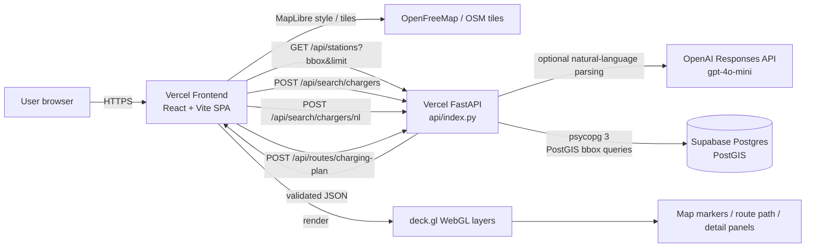
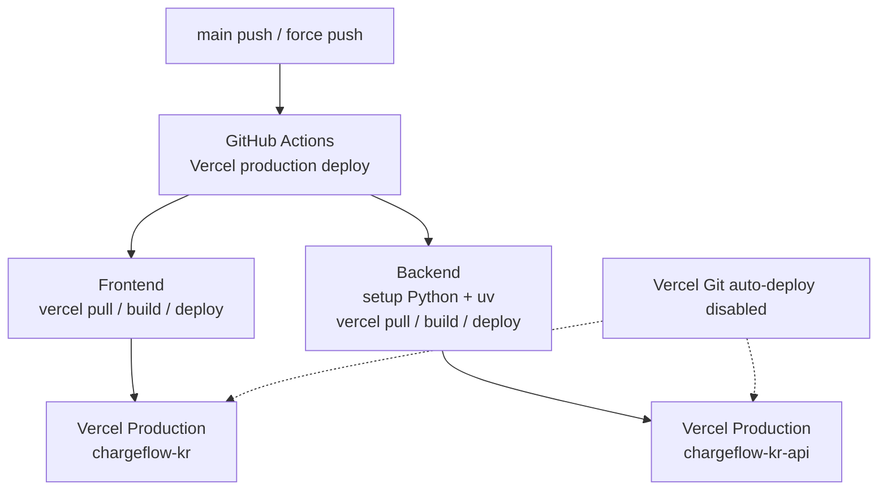

# Architecture

This document describes the current ChargeFlow KR runtime architecture. Historical MVP notes and target-only paths have been removed from this file; deferred ideas belong in phase documents.

## Runtime Data Flow

The frontend is a browser-run SPA. It does not proxy through a frontend server; it calls the backend origin from `VITE_API_BASE_URL`. Production CORS must therefore allow the Vercel frontend origin.

## Deployment Flow

The frontend and backend are separate Vercel projects. Backend only owns database credentials. The frontend receives only public runtime config such as feature flags and API base URL.

## Feature Flows

| Feature | Frontend | Backend | External | Database |
|---|---|---|---|---|
| Viewport stations | Calculate bbox from `ViewState`, call `/api/stations` | Validate bbox and limit, add `Server-Timing` | OpenFreeMap tiles | `stations` + first `connectors` row via PostGIS envelope query |
| Structured charger search | Submit typed command to `/api/search/chargers` | Validate command, resolve place, apply radius/filter/sort | None | `places`, `place_aliases`, `stations`, `connectors` |
| Natural-language charger search | Submit chat text to `/api/search/chargers/nl` | Parse with OpenAI when configured, otherwise deterministic parser; validate parsed command | OpenAI Responses API, optional | Same search path as structured command |
| Route charging plan | Pick deterministic route fixture, submit vehicle/profile constraints | Build route bbox, fetch station candidates, filter corridor, score recommendations with LangGraph route planner | None | `stations`, `connectors` |
| Static demo fallback | Load `public/sample-chargers.json` when viewport API flag is off | Not involved | Map tiles only | Not involved |

## Backend Boundaries

FastAPI exposes:

- `GET /` and `GET /healthz` for health checks.
- `GET /api/stations?bbox=west,south,east,north&limit=n` for viewport station GeoJSON.
- `POST /api/search/chargers` for validated structured charger search.
- `POST /api/search/chargers/nl` for natural-language search that resolves to the same structured command path.
- `POST /api/routes/charging-plan` for route-corridor charging recommendations.

Route geometry is input data from deterministic fixtures or validated request payloads. The backend does not generate routes, call a routing provider, use live traffic, or use weather.

## Database Shape

The current PostGIS schema is owned by `backend/app/db/schema.sql`:

- `stations`: station identity, operator, address, region, and point geometry.
- `connectors`: connector type, max power, current type, status, and status timestamp.
- `status_events`: imported connector status observations.
- `places`: DB-backed place resolver records with point geometry and optional area bbox.
- `place_aliases`: normalized aliases used by structured and natural-language search.

`places` and `place_aliases` currently enable RLS as defense in depth. Public clients do not connect to Supabase directly.

## Design Rules

- PostGIS owns spatial truth for production station, place, and route-candidate lookup.
- The frontend renders charger and route overlays with deck.gl, not DOM markers.
- Natural-language search never answers distance, availability, filters, or coordinates from model memory; parsed output must pass the local typed schema and DB-backed resolver.
- Static GeoJSON is local/demo fallback only. Production viewport data comes from `/api/stations`.
- Route planning is deterministic charger-stop recommendation, not navigation. No live traffic, weather, external routing API, pricing, reservations, or wait-time prediction is claimed.
- Backend responses must label data source/freshness and route-planner limitations so the UI can display local-data boundaries.
