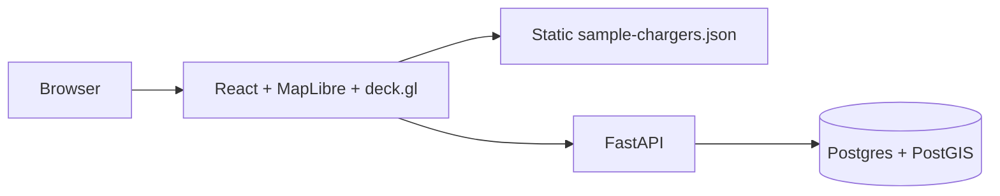
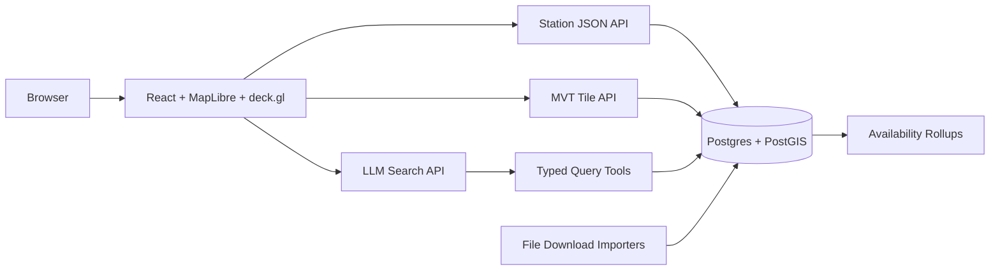

# Architecture

## Current MVP

## Target Path

## Design Rules

- PostGIS owns spatial truth.
- LLM search never answers distance, availability, or filters from memory.
- Frontend renders large layers through deck.gl, not DOM markers.
- Static GeoJSON remains demo-only.
- Public-data API keys remain deferred; near-term ingestion uses login-free downloaded files.
